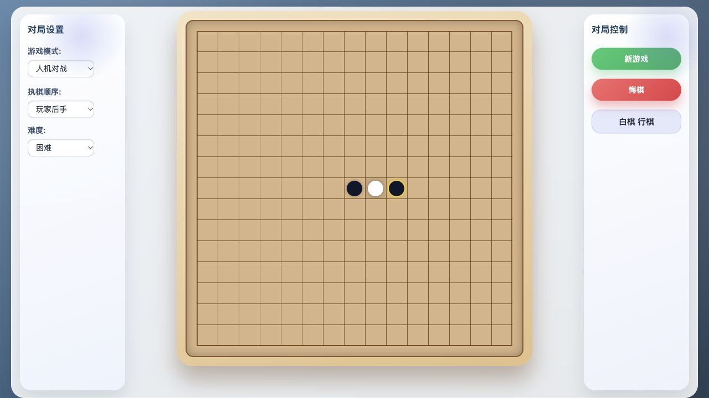

# 五子棋网页游戏



## 项目简介
这是一个使用原生 HTML、CSS 和 JavaScript 实现的 15x15 五子棋网页游戏，支持双人对战与人机对战两种模式。界面采用自适应布局，桌面与移动端均能流畅运行，无需构建或后端服务即可运行。支持本地 AI 和大模型对弈，由使用者填写自己的模型 API 密钥。

## 功能亮点
- 双人 (PVP) 与人机 (PVE) 对战模式，可随时切换
- 提供简单 / 中等 / 困难 / 大模型 四档 AI 难度，支持玩家先手或后手
- 棋盘落子动画、最近一步高亮、对局状态提示与结果弹窗
- 内置悔棋功能与一键重开，方便快速试探或复盘
- 大模型难度支持自定义端点、API 密钥与模型名称，并附带一键连通性测试
- DeepSeek V4 可配置思考模式开关与 High / Max 思考强度
- 完全前端实现，可直接打开网页；大模型密钥只在本次页面使用，不写入浏览器存储

## 快速开始

macOS 和 Windows 均可直接双击 `index.html`，无需安装 Python 或启动服务。选择“大模型”后，在页面填写自己的 API 密钥即可使用；端点与模型默认已填好。刷新或关闭页面后密钥会清除，再次使用时重新输入。

开发调试时可选用静态服务器：

```bash
python3 -m http.server 8000
# Windows：py -3 -m http.server 8000
# 浏览器访问 http://localhost:8000
```

同一局域网内共享时，在项目目录运行 `python3 -m http.server 8765 --bind 0.0.0.0`（Windows 用 `py -3` 替代 `python3`），其他终端访问 `http://主机局域网IP:8765`。保持终端开启，按 Ctrl+C 停止服务。每个终端各自开局；这不是联网对战，各自输入的 API 密钥也不会保存到静态服务器。

密码输入框只遮挡显示，本人仍可通过开发者工具查看页面内存中的密钥。项目没有保存密钥的服务端，密钥直接用于请求使用者指定的模型端点。旧版保存的密钥会在该来源的页面刷新时从 `gomoku.llmConfig` 中删除，其他浏览器或来源的旧副本需分别刷新清理。

## 操作说明
- 左侧“对局设置”面板：
  - `游戏模式` 在双人对战与人机对战之间切换
  - `难度` 控制 AI 启发式强度（仅 PVE 时显示）
  - `执棋顺序` 切换玩家先手或后手（仅 PVE 时显示）
- 中央棋盘区域：点击空白交叉点即可落子，系统会在 AI 回合自动行动
- 右侧“对局控制”面板：
  - `新游戏` 重置棋盘与对局状态
  - `悔棋` 撤销最近一步（PVE 模式下会自动恢复到玩家执棋）
  - 状态栏实时提示当前执棋方或游戏结果
- 对局结束时将出现结果弹窗，可选择继续观棋或立即再来一局

## AI 难度说明
- `简单`：保证能成五时取胜、需要挡五时防守；其余采用单步攻防评分与随机选择，适合入门
- `中等`：识别连续与跳跃棋形，计算自己落子后对手的强应手；迭代搜索最多三层、最多十二个根候选，每手约 250 毫秒预算
- `困难`：识别连续及跳跃棋形，优先成五和解杀，加入连续冲四必胜搜索（最多六次进攻，逐手验证对手强制应手），以及包含活三的分支搜索（最多三轮威胁并检查终结落子）。活三搜索检查封堵和冲四反击分支，只有所有有效防守都能破解才返回胜法。并检测对方的连续杀棋，剔除已证明会输的防守应手，将关键防守点纳入候选；未算完的应手保留。再用迭代加深与 Alpha-Beta 搜索对手的强应手；常规搜索最多六层，每手约 1.2 秒预算，保留最后完整搜索层的结果。支持 Web Worker 的浏览器在后台计算，悔棋、重开会终止旧搜索。该难度仍为有限搜索，不能保证必胜
- `大模型`：通过自定义 LLM 接口评估棋盘威胁、候选落子与攻守理由。系统会向模型提供：
  - 当前棋盘 ASCII 表示与最近落子列表
  - 双方活四 / 冲四 / 活三 / 眠三等威胁摘要
  - 预先筛选的合法落子候选列表（模型必须从中选择）
  - 约定的输出 JSON 格式（含 `move` / `analysis` / `banter` 字段）
选择该难度时可配置端点、API 密钥与模型名称，并点击“测试连通性”验证配置是否可用。默认端点和模型已填写，只需输入自己的密钥。
默认端点为 `https://api.deepseek.com/v1`，模型名称为 `deepseek-flash`。浏览器保存的官方端点旧默认名称 `deepseek-v4-flash` 会自动迁移；其他自定义模型名称保持不变。游戏默认使用本地“困难”难度，切换到“大模型”后才会调用 API。
默认关闭思考；手动开启时默认强度为 Max。升级时会将旧版保存的思考设置关闭一次，之后保留个人选择。DeepSeek V4 官方支持 `thinking.type` 控制思考开关，并通过 `reasoning_effort` 设置 `high` 或 `max` 思考强度；开启思考时，客户端会自动使用这两个参数。

对局请求最多等待 120 秒；超时或失败后改由本地困难 AI 继续落子。悔棋、重开等主动取消只停止旧回合，不影响新局。连通性检测关闭思考，避免把测试的短输出预算耗在推理中；对局仍保持所选的思考设置。

> **提示**：`analysis` 字段要求给出攻守双向理由（格式示例 `攻:左翼活三成型; 守:封锁右上夹击`），`banter` 字段则用于输出一句幽默短评，方便识别为大模型落子。

### 推理模型兼容性
- “推理兜底”只在没有规范结果时尝试从推理文字提取候选坐标，不增加棋力，也不控制思考。文字可能含有被否决的坐标，使用规范 JSON 的模型建议关闭此项。
- 建议在 JSON 中同步填充 `move` 字段，并在推理文本中重复坐标或棋盘方位（如 `move: (x=7, y=6)`），以降低解析失误概率。
- 勾选“允许从推理内容识别落子”后，即便模型只返回推理文字而未给出明确坐标，客户端也会尝试从文字中提取候选落点；取消勾选时则必须返回完整的结构化落子信息。

## 项目结构
```
index.html   # 页面结构与 UI 布局
style.css    # 自适应界面与棋盘样式
script.js    # GomokuGame 核心状态、规则与 UI 事件
ai.js        # 简单 / 中等 / 困难 AI 与棋型评估
llm.js       # 大模型配置、请求、超时取消与响应解析
app.js       # 浏览器入口，按加载顺序完成游戏初始化
ai-worker.js # 后台计算困难 AI，支持取消
tests/       # 棋力、密钥保存策略与超时取消回归测试
```
项目中未引入构建工具，所有游戏资源均直接在浏览器端运行。直接打开文件时，如果浏览器限制 Web Worker，会使用主线程计算作为兼容回退。

## 开发与维护建议
- 新增 UI 元素时，请保持在 `.container` 布局内部，避免破坏响应式结构
- 统一使用 4 空格缩进，JavaScript 标识符采用 lowerCamelCase，CSS 类名使用 kebab-case
- 更新 AI 策略或 LLM 提示词时，可先以 `console.debug` 输出候选落点 / 模型请求载荷进行调试，提交前记得移除
- 纯算法调整优先跑题库、回归测试与新旧版本对局；修改界面、Worker 通信或浏览器兼容逻辑时，再手动检查 PVP、PVE、悔棋、重开与移动端视口
- 大模型模式下建议额外验证：连通性测试按钮、首次思考提示、模型是否严格使用候选列表以及攻守分析是否合理

## 回归检查
```bash
node --test tests/*.test.cjs
# 可选：六局固定种子的本地难度对局比较
node tests/ai-benchmark.cjs
# 新旧版本对局：4 种开局各交换黑白，默认每手 250ms，记录完整棋谱与耗时
node tests/ai-compare.cjs --baseline 8a4f590 --output /tmp/gobang-comparison.json
# 按游戏实际困难档预算比较
node tests/ai-compare.cjs --baseline 8a4f590 --time-ms 1200 --node-limit 12000
# 固定节点模式避免机器负载改变搜索截止点；真实耗时仍会记录
node tests/ai-compare.cjs --baseline 8a4f590 --deterministic --node-limit 1500
```
### 棋局题库

`tests/fixtures/tactics.json` 存放 15 个具名局面，包括边线/角部解杀、跳四、四三、双活三、连续冲四及活三分支，也包含单活三可防、冲四反击和伪活三等反例。题库自动换色、旋转；多个防守点都可解杀时验证结果，不强行限定一个坐标。部分是研究摆局，允许黑白子数不平衡，但不能重叠或从已经结束的局面开始。

`tests/helpers/rules.cjs` 独立实现成五检查与证明校验，不调用 AI 评分或候选筛选：进攻只需找到一种胜法，防守则穷举所有合法应手。搜索预算耗尽只表示尚未找到证明，不代表不存在胜法。可将实际对局中漏算的棋盘继续加入题库。

### 新旧版本比较

`--baseline` 和 `--candidate` 接受本地 Git 提交；候选默认是当前工作区。每个开局使用相同随机种子交换执棋颜色，报告包含双方版本、候选源码哈希、运行参数、完整棋谱、胜负及每手耗时。到达步数上限记为 `capped`，不会算成和棋；只有棋盘填满才记和棋。`--rounds` 增加开局轮次，`--seed` 固定随机种子，`--max-moves` 控制总步数上限。

固定节点模式用于复现搜索选择，不能替代真实时间预算的体验检查。少量开局的胜率不能代表棋力等级；应结合题库和耗时共同判断，不因一盘获胜就认定新版更强。

测试只使用虚拟密钥与模拟上游，不会调用真实 DeepSeek 或产生 API 费用。已在 macOS 的 Chrome 和 Codex 内置浏览器检查对局及设置流程，并验证 390px 小屏布局；Windows 实机和真实 DeepSeek 调用尚未验证。有限的自对弈结果只能作为难度梯度参考，不能代表棋力等级。

## 部署提示
游戏文件可直接托管到静态网站。使用者填写自己的密钥，浏览器直接请求指定的模型端点；项目不代存密钥。模型服务需允许网页来源的跨域请求。
